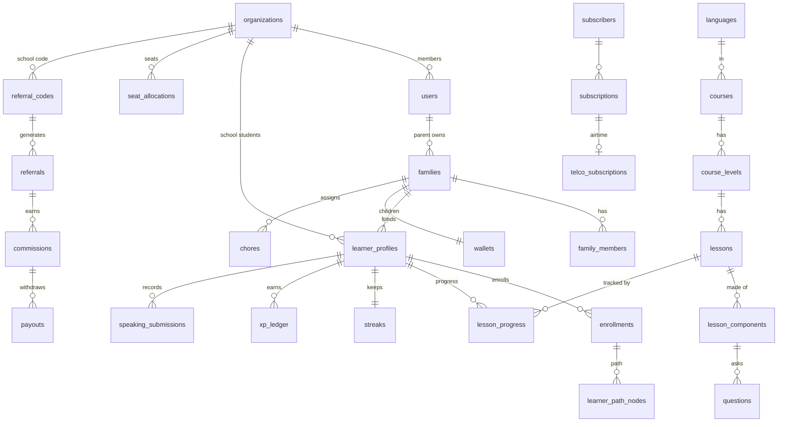

# MAHADUM.360 — Backend Architecture
## Multi-Tenancy · Database Design · API Plan

**Stack:** Laravel 12/13 (PHP 8.3+) · MySQL 8 / PostgreSQL 15 · Redis · API-first
**Version:** 1.0 — Engineering draft
**Scope:** Super Admin · School (Admin + Teacher) · Parent · Child/Learner

---

## 0. Decisions at a glance

| Decision | Choice | Why |
|---|---|---|
| **Tenancy model** | **Single database, row-level scoping** (shared schema) | Curriculum is shared across everyone; you have both B2C families and B2B schools; Super Admin needs cross-tenant analytics. DB-per-tenant would fragment shared content and break B2C. |
| **Tenancy package** | **stancl/tenancy** (single-database mode) | Most feature-complete, actively maintained, and leaves a migration path to DB-per-tenant for large enterprise school districts later, without rewriting. |
| **What is a "tenant"** | **Organization** (School / Institution / Community) | Families are *not* tenants — they are direct consumer accounts grouped by a `families` table. |
| **RBAC** | **spatie/laravel-permission** | Mature roles + permissions; maps cleanly to the 7-role hierarchy. |
| **API auth** | **Laravel Sanctum** | First-party web SPA (cookie) + mobile (bearer token). Passport not needed (no third-party OAuth yet). |
| **Social login** | **Laravel Socialite** (Google) | Matches locked auth decision (username/password + Google). |
| **Phone** | OTP **only at telco-billing opt-in** | Not part of login. |
| **Payments** | Monnify (default) / Paystack / Flutterwave + Telco SDP (airtime VAS) | Per BRD. Webhook-driven. |

> Note on the package choice: because Mahadum is B2C-heavy with shared content, the *core mechanism* is a `BelongsToTenant` global scope on an `organization_id` column. stancl/tenancy manages the tenant lifecycle and context around that. If you wanted the absolute lightest setup you could hand-roll the scope with no package — but stancl gives you tenant context, cache/queue isolation, and the DB-per-tenant escape hatch for free.

---

## 1. Multi-tenancy architecture

### 1.1 The model

```
                         ┌─────────────────────────────┐
                         │      CENTRAL (shared)        │
                         │  languages · courses ·       │
                         │  levels · lessons · quizzes ·│
                         │  badges · plans · cultural   │
                         │  content   (NO tenant_id)    │
                         └──────────────┬──────────────┘
                                        │ referenced by everyone
              ┌─────────────────────────┼─────────────────────────┐
              │                         │                         │
     ┌────────▼─────────┐      ┌────────▼─────────┐      ┌────────▼─────────┐
     │  ORG: School A   │      │  ORG: School B   │      │  DIRECT (no org) │
     │ organization_id=1│      │ organization_id=2│      │ organization_id  │
     │ teachers,classes,│      │ ...              │      │  = NULL          │
     │ seats, students  │      │                  │      │ families,        │
     └──────────────────┘      └──────────────────┘      │ diaspora adults  │
                                                          └──────────────────┘
```

- **Tenant = `organizations` row.** Schools, institutions, churches/NYSC communities.
- **Direct consumers** (families, diaspora adults) have `organization_id = NULL`.
- **Content tables carry no tenant column** — they are global and shared.
- A **`BelongsToTenant` trait** adds a global scope: any tenant-scoped query is automatically filtered by the current `organization_id`. Super Admin runs *unscoped* (a `BypassesTenancy` guard).

### 1.2 Tenant resolution (request → tenant context)

Order of precedence:
1. **Super Admin token** → no tenant scope (global).
2. **`X-Organization-Id` header** (web console / mobile) validated against the user's memberships.
3. **Derived** from the authenticated user's single org membership (most teachers/school-admins belong to exactly one).
4. **None** → direct-consumer context (families); queries scoped to the user's own family.

Middleware: `IdentifyTenant` runs after `auth:sanctum`, sets `tenant()` for the request lifecycle, and rejects cross-tenant access (403).

### 1.3 Isolation guarantees

- Every tenant-scoped model uses `BelongsToTenant` (global scope + auto-fill `organization_id` on create).
- **Writes** validate that referenced foreign keys belong to the same tenant.
- **Policies** (Laravel Gate) enforce role + tenant on every action.
- **Audit log** records actor, tenant, action, before/after for sensitive ops (payouts, seat changes, role grants).

### 1.4 Future path
If a large school district demands physical isolation, stancl/tenancy lets that *single* organization graduate to its own database without touching the B2C side. Don't build this now — keep it as a documented option.

---

## 2. Identity & role model (COPPA-aware)

The single most important modelling decision: **separate "account/auth" from "learner identity."**

- **`users`** — authenticatable accounts: Super Admin, Content Owner, Teacher, Supervisor, School Admin, Parent, *and* adult/older-student learners who log in.
- **`learner_profiles`** — the actual learner entity for *every* learner (child or adult). A child under 13 has a `learner_profile` with **no independent login** — it lives under a `family` and is operated by the parent (COPPA/NDPA). An adult learner has both a `user` and a `learner_profile`.
- **`families`** — household unit owned by a parent `user`; may optionally link to an `organization` (when a school referral enrolls the family).
- **`organizations`** — the tenant (school/institution/community).

### Roles (spatie/laravel-permission)

| Role | Scope | Key abilities |
|---|---|---|
| `super_admin` | Global (no tenant) | Everything; settlement panel; payout approval; content & language control |
| `content_owner` | Global / assigned | CMS: create courses, levels, lessons, quizzes; lesson analytics |
| `teacher` | Organization | Class rosters, assignments, speech/quiz analytics, referral hub |
| `supervisor` | Organization | Read-only oversight across classes |
| `school_admin` | Organization | School dashboard, roster, CSV import, seats, invoices |
| `parent` | Family | Family dashboard, wallet, chores, review queue, referrals |
| `student` | Family or Organization | Own learning path, progress, leaderboard |

> **Granular permissions per admin aspect** (content, billing, schools, finance/settlement,
> referrals, users, analytics, system) are materialised in the
> [`create_permission_tables` migration](database/migrations/2026_01_01_000070_create_permission_tables.php)
> + [`RolesAndPermissionsSeeder`](database/seeders/RolesAndPermissionsSeeder.php). Full
> role × permission matrix: [Roles & Permissions](Mahadum360_Roles_Permissions.md). Roles
> are **global capabilities**; tenant scope comes from `IdentifyTenant` membership checks +
> `BelongsToTenant` + policies (not spatie teams — see that doc §1).

---

## 3. Database schema

> Conventions: every table has `id` (bigint/ULID), `created_at`, `updated_at`; soft-deletes (`deleted_at`) on user-facing records. `organization_id` is **nullable** and present only on tenant-scoped tables (marked 🔒). FKs end in `_id`. Money stored as integer **minor units** (kobo) + `currency`. Coins are integers.

### A. Tenancy & Identity

**organizations** — *the tenant*
`id, name, type(school|institution|community), slug, cac_number, address, contact_email, domain(verified), status(pending|active|suspended), licence_model(annual|per_term), settings(json)`

**users**
`id, organization_id🔒(nullable), name, email(unique), username(unique,nullable), phone(nullable), password(nullable for social-only), google_id(nullable), email_verified_at, locale, status, last_login_at`

**organization_user** — membership pivot
`id, organization_id, user_id, role, status` *(a user may belong to >1 org, e.g. a teacher across campuses)*

**families**
`id, owner_user_id(parent), name, organization_id🔒(nullable, set if school-linked), referral_source_code(nullable), child_limit(default 6)`

**family_members** — links users/profiles into a family
`id, family_id, user_id(nullable), learner_profile_id(nullable), relationship(parent|child|guardian|spouse), is_account_owner`

**learner_profiles** — *every learner (child or adult)*
`id, family_id(nullable), organization_id🔒(nullable), user_id(nullable — null for under-13 children), display_name, avatar_id, date_of_birth, age_band, target_language_id, current_level, parental_pin_protected(bool)`

**devices** — fraud fingerprinting
`id, user_id, device_fingerprint, imei(nullable), ip_last_seen, platform, first_seen_at, last_seen_at`

Plus spatie tables: `roles`, `permissions`, `model_has_roles`, `model_has_permissions`, `role_has_permissions` (with a `team`/tenant key = `organization_id` for org-scoped roles).

### B. Content / Curriculum — **CENTRAL (shared, no tenant_id)**

**languages** `id, name, code(yo|ig|ha|pcm), script(latin|ajami), rtl(bool), is_active`

**courses** `id, language_id, title, description, level_band, owner_user_id(content_owner), status(draft|published), is_published`

**course_levels** `id, course_id, title, position, has_assessment(bool)`

**lessons** `id, course_level_id, title, position, est_minutes, is_locked_by_default, cultural_component_id(nullable)`
> Business Rule 1: a lesson cannot be published without ≥1 video + ≥1 quiz + ≥1 speaking challenge — enforced at publish.

**lesson_components** `id, lesson_id, type(video|quiz|speaking|exercise|game|assignment), position, payload(json), media_asset_id(nullable)`
> Mandatory consumption order encoded by `position` + `type`.

**questions** `id, lesson_component_id, type(mcq|listen_repeat|match|complete_chat), prompt, audio_asset_id(nullable), explanation`

**question_options** `id, question_id, label, is_correct, position`

**media_assets** `id, type(video|audio|image|caption), url, qualities(json: 240p/360p/720p), duration_seconds, captions(json srt/vtt), uploaded_by`

**cultural_contents** `id, language_id, kind(proverb|folktale|festival|history|song), title, body, media_asset_id`

### C. Learning & Progress  🔒(family/org scoped)

**placement_assessments** `id, learner_profile_id, language_id, result_level, answers(json), completed_at`

**enrollments** `id, learner_profile_id, course_id, status, started_at`

**learner_path_nodes** `id, enrollment_id, lesson_id, state(locked|active|completed), position`

**lesson_progress** `id, learner_profile_id, lesson_id, status, score, components_completed, started_at, completed_at`
> Business Rule 3: progress finalises only when **all** components complete. Score = 30% video + 20% quiz + 25% speaking + 15% assignment + 10% engagement.

**component_progress** `id, lesson_progress_id, lesson_component_id, status, score, attempts, data(json)`

**speaking_submissions** `id, learner_profile_id, lesson_component_id, audio_asset_id, ai_score(nullable), tone_accuracy, status(pending_ai|scored|needs_review), reviewed_by_parent(bool)`
> AI scoring **deferred (Option B)** — column kept; `status='needs_review'` path ships now.

**assignment_submissions** `id, learner_profile_id, lesson_component_id, media_asset_id, parent_review_status, coins_locked`

**xapi_statements** `id, learner_profile_id, verb, object_iri, raw(json), lrs_synced_at` — written by `XapiRecorder` on every learning event (enrol→*registered*, component→*experienced/completed*, quiz→*answered*, lesson→*completed*, speaking→*responded*, placement→*completed*). Learners are xAPI agents identified by account `learner:<id>` (no email — child profiles have no login). `lrs_synced_at` stays null; a future job can push unsynced rows to an external LRS (emission is LRS-agnostic).
> Mirror/queue to an external LRS. **LRS is never the source of truth for money or gating.**

### D. Gamification  🔒

**streaks** `id, learner_profile_id, current_count, longest_count, last_active_date, frozen_until(nullable), state(active|at_risk|frozen|lost)`

**streak_protections** `id, learner_profile_id, type(grace|shield), source(telco_grace|coin_purchase|premium), active_from, active_to, consumed`
> 48-hour telco grace + purchasable Streak Shield.

**hearts** `id, learner_profile_id, current(0-5), refills_at`
> Rule 4: hearts/coins **never gate core learning** — empty hearts redirect to practice/ad, not a lockout.

**xp_ledger** `id, learner_profile_id, amount, source(lesson|speaking|assignment|challenge|streak), reference_id, created_at`

**badges** *(central)* `id, code, name, description, icon` · **learner_badges** 🔒 `id, learner_profile_id, badge_id, earned_at`

**leagues** `id, name, tier, week_start` · **league_memberships** 🔒 `id, league_id, learner_profile_id, weekly_xp, rank`

### E. Family & Chores  🔒(family)

**chores** `id, family_id, created_by_user_id, assignee_learner_profile_id, title, description, coin_reward, status(active|pending_review|approved|rejected|expired), due_at`

**chore_submissions** `id, chore_id, evidence_media_id(nullable), evidence_type(photo|audio|video|checkbox), submitted_at, decision(approve|reject|more_evidence), decided_by, decided_at`
> Rule 8: coins released only on explicit parent approval.

### F. Wallet & Coins  🔒

**wallets** `id, owner_type(family|organization|learner), owner_id, coin_balance, currency_balance_minor, currency`

**coin_transactions** *(ledger)* `id, wallet_id, learner_profile_id(nullable), type(credit|debit), source(chore|reward|referral|purchase|transfer), amount, balance_after, reference_type, reference_id`

**wallet_funding_transactions** `id, wallet_id, gateway(monnify|flutterwave|paystack), amount_minor, currency, status, gateway_ref, gateway_txn_ref, raw(json)`

### G. Monetisation & Billing  🔒

**plans** *(central)* `id, code(free|premium_individual|premium_family|school_term|school_annual), name, price_minor, currency, interval, max_profiles, features(json)`

**subscriptions** `id, subscriber_type(user|family|organization), subscriber_id, plan_id, status(active|grace|past_due|cancelled), method(card|airtime|invoice), gateway_txn_ref, started_at, renews_at, cancelled_at`

**telco_subscriptions** `id, subscription_id, msisdn, operator(mtn|airtel|glo|t2), daily_amount_minor, state(active|grace|soft_downgrade|cancelled), grace_until, next_attempt_at`
> Lifecycle: active → grace(48h) → soft_downgrade → reactivation. Daily charge at 02:00; auto-retry every 24h; STOP→3600 cancels.

**telco_billing_attempts** `id, telco_subscription_id, attempted_at, amount_minor, result(success|insufficient|error), operator_ref`

**data_bundle_purchases** `id, user_id, operator, bundle_mb, amount_minor, status, consent_at`

**ad_impressions** `id, learner_profile_id, ad_ref, placement(post_lesson|rewarded_heart), coppa_passed(bool), shown_at`
> Rule 10: ads only between lesson nodes; COPPA/NDPA filtered.

### H. Referrals & Commissions  🔒

**referral_codes** `id, owner_type(user|organization), owner_id, code(unique), kind(user|school), status(active|flagged|disabled)`

**referrals** `id, referral_code_id, referred_user_id, referred_subscription_id(nullable), status(pending|qualified|rejected), device_fingerprint, signed_up_at`
> FR-7.1 device/IP block; FR-7.5 velocity block (>15 sign-ups / 24h → flag + freeze).

**commissions** `id, referral_id, beneficiary_type, beneficiary_id, amount_minor, status(pending_escrow|cleared|cancelled), escrow_until(14 days), cleared_at`
> Rule 9 / FR-7.3: 14-day escrow; chargeback in window cancels instantly.

**payouts** `id, beneficiary_type, beneficiary_id, amount_minor, method(bank|coins), status, requested_at, approved_by, paid_at`
> Floor ₦5,000 cleared; cap ₦50,000/mo individuals (no cap for verified schools).

**promo_codes** `id, code, discount_type(percent|fixed), value, applicable_tier, valid_from, valid_to, max_redemptions, redeemed_count, status` · **promo_redemptions** `id, promo_code_id, organization_id, payment_id`

### I. School Operations  🔒

**school_classes** `id, organization_id, name, level, teacher_user_id` · **class_enrollments** `id, school_class_id, learner_profile_id`

**seat_allocations** `id, organization_id, total_purchased, active_filled, term_label, expires_at, auto_renew`
> Tiered discounts: 51–200 → 10%, 201–500 → 20%, 500+ → enterprise. ≥40% inactive 4wk → status review.

**invoices** `id, organization_id, type(proforma|final), amount_minor, status, pdf_asset_id, issued_at, paid_at` — PDF rendered on demand by `InvoicePdfRenderer` (dompdf, Blade template) into a private media asset (local disk), streamed via `GET /schools/{id}/invoices/{invoice}/pdf`; generated once, then reused.

### J. System

**notifications** `id(uuid), type, notifiable(morph), data(json), read_at` — Laravel's standard table. Notifications (`SubscriptionActivated` receipt, `PayoutApproved`) implement `ShouldQueue` and fan out over **database** + **mail** + **push** + one **text channel** (SMS or WhatsApp, per `services.messaging.text_channel`). The SMS/WhatsApp/push transports resolve through `MessagingManager` → a swappable `MessagingGateway` (`HttpMessagingGateway` live, `NullMessagingGateway` off-live), so they no-op in local/CI. Channels also self-skip when the recipient has no phone (SMS/WhatsApp) or no device push tokens. Read via `/me/notifications`.
**support_tickets** `id, user_id, channel, subject, status, priority, assigned_to`
**audit_logs** `id, organization_id🔒, actor_user_id, action, subject_type, subject_id, before(json), after(json), ip` — written via `AuditLogger` on sensitive actions: `payout.approved`, `subscription.refunded`, `funding.refunded`, `family.pin_set`, `telco.enrolled`, `organization.activated`.
**parental_consents** `id, family_id, guardian_user_id, learner_profile_id, type(coppa_parental|data_processing), policy_version, granted_at, ip, user_agent` — verifiable COPPA/NDPA consent captured when a guardian creates a child profile (consent is mandatory; under the configured minor age → `coppa_parental`).
**webhook_events** `id, source(monnify|paystack|flutterwave|telco), event, payload(json), processed_at, status` *(idempotency)*

---

## 4. Core ER diagram (Mermaid)



---

## 5. Tenant-scoping matrix

| Concern | Scoping | Column |
|---|---|---|
| Languages, courses, lessons, questions, badges, plans, cultural content | **Central / shared** | — |
| Users, learner_profiles, enrollments, progress, gamification | **Org (nullable) + family** | `organization_id`, `family_id` |
| Wallets, coins, chores | **Family** | `family_id` |
| Subscriptions, telco billing | **Subscriber polymorphic** | `subscriber_type/id` |
| Referral codes, commissions, payouts | **Owner polymorphic** | `owner_type/id` |
| Classes, seats, invoices | **Org only** | `organization_id` |
| Audit logs | **Org (nullable)** | `organization_id` |

---

## 6. API design

### 6.1 Conventions
- Base: `https://api.mahadum360.com/api/v1` · JSON · Sanctum auth.
- **Web SPA** → cookie session. The SPA first calls `GET /sanctum/csrf-cookie`
  (sets the `XSRF-TOKEN` cookie), then logs in / calls the API with credentials.
  Wired via `statefulApi()` in `bootstrap/app.php` + `config/cors.php`
  (`supports_credentials: true`, origins from `FRONTEND_URLS`); stateful hosts are
  listed in `SANCTUM_STATEFUL_DOMAINS`. Requests whose Origin matches a stateful
  host authenticate through the `web` session guard with CSRF enforced; all others
  fall through to bearer-token auth.
- **Mobile** → bearer token (`POST /auth/login` etc.), stored in iOS Keychain / Android Keystore.
- Standard envelope: `{ data, meta, links }`; cursor pagination; RFC-7807 errors.
- Middleware chain: `auth:sanctum` → `IdentifyTenant` → `role`/`permission` → `throttle`.
- Versioned; abilities/scopes on tokens; idempotency keys on POST money endpoints.

### 6.2 Auth
| Method | Endpoint | Notes |
|---|---|---|
| POST | `/auth/register` | parent/adult; age-gate branches to family setup |
| POST | `/auth/login` | username/email + password |
| POST | `/auth/token` | mobile bearer token issue |
| GET | `/auth/google/redirect` · `/auth/google/callback` | Socialite |
| POST | `/auth/logout` · `/auth/forgot` · `/auth/reset` | |
| POST | `/auth/telco/otp/request` · `/verify` | **only** at airtime opt-in |
| GET | `/email/verify/{id}/{hash}` | signed link (public); marks `email_verified_at`. `User implements MustVerifyEmail`; the verification mail is fired by the `Registered` event on register (Google sign-ups arrive pre-verified). |
| POST | `/email/verification-notification` | resend (auth, throttled) |
| GET | `/me` | profile (incl. `email_verified`) + memberships + active tenant |
| GET | `/me/notifications` · POST `/{id}/read` · `/read-all` | in-app notifications + unread count |
| POST | `/profiles/switch` | child profile switch (parental PIN) |

### 6.3 By domain (representative endpoints)

**Content (read shared; write = content_owner)**
`GET /languages` · `GET /courses?language=ig` · `GET /courses/{id}/levels` · `GET /lessons/{id}` · `POST /courses` · `POST /lessons/{id}/components` · `POST /lessons/{id}/publish`

**Learning (learner/parent)**
`POST /assessments` · `GET /learners/{id}/path` · `GET /lessons/{id}/play` · `POST /lessons/{id}/progress` · `POST /components/{id}/answer` · `POST /speaking-submissions` · `GET /learners/{id}/progress`

**Gamification**
`GET /learners/{id}/streak` · `POST /streak/shield` · `GET /leagues/current` · `GET /leaderboard` · `GET /learners/{id}/badges` · `GET /hearts`

**Family & wallet (parent)**
`GET /family` · `POST /family/children` · `GET /wallet` · `POST /wallet/fund` · `POST /wallet/transfer` · `GET /chores` · `POST /chores` · `POST /chores/{id}/review` · `GET /reviews/pending`

**Billing**
`GET /plans` · `POST /subscriptions` · `POST /subscriptions/{id}/cancel` · `POST /telco/subscribe` · `GET /telco/status` · `POST /data-bundles/purchase`

**Referrals**
`GET /referral-code` · `GET /referrals/summary` · `POST /payouts/request` · `GET /payouts`

**School / Teacher (org-scoped)**
`GET /schools/{id}/dashboard` · `POST /schools/{id}/students/import` (CSV) · `GET /classes` · `GET /classes/{id}/analytics` · `GET /schools/{id}/seats` · `POST /schools/{id}/seats/purchase` · `GET /schools/{id}/invoices` · `GET /schools/{id}/invoices/{invoice}/pdf` · `GET /schools/{id}/referrals`

**Super Admin (global, unscoped)**
`GET /admin/metrics` · `GET /admin/settlements` · `POST /admin/payouts/{id}/approve` · `GET /admin/billing/health` · `POST /admin/promo-codes` · `PATCH /admin/referral-rates` · `GET /admin/organizations` · `POST /admin/organizations/{id}/activate`

### 6.4 Webhooks (inbound, signature-verified, idempotent)
`POST /webhooks/monnify` · `POST /webhooks/paystack` · `POST /webhooks/flutterwave` · `POST /webhooks/telco/dlr` (delivery/billing result)

**Outbound checkout** is opened through `PaymentGatewayManager`, which resolves a swappable `PaymentGateway` driver (`MonnifyGateway` / `PaystackGateway` / `FlutterwaveGateway`) by name. **Monnify is the default** (`services.payments.default`). It returns a `NullGateway` (no HTTP, null `checkout_url`) unless `services.payments.live` is on, so local/CI never hit a live gateway and the live path is opt-in per environment. Our `reference` (`sub_<id>` or a funding UUID) is passed through so the inbound webhook correlates back. Monnify is a two-step flow (Basic `api_key:secret` → bearer token → `init-transaction`) and quotes amounts in **major units (Naira)**; it also returns its own `transactionReference`, which we persist as `gateway_txn_ref` on **both** the funding row and the subscription, because its refund webhook carries that id rather than our reference.

`PaymentService` normalises every gateway event to a **kind** — `success | refund | ignored` — keyed on the gateway event id (replays return `duplicate`). `success` confirms a wallet funding or activates a subscription; `refund` (Monnify `SUCCESSFUL_REFUND`, Paystack `refund.processed`, Flutterwave `charge.refund`/`REFUNDED`) reverses a settled funding (`debitCurrency`, clamped at zero, funding → `refunded`) or cancels a subscription (→ `refunded`); any unrecognised event is recorded as `ignored` and **moves no money**. Both fundings and subscriptions are correlated by our reference (`gateway_ref` / `sub_<id>`) **or** the gateway's `gateway_txn_ref`, so a Monnify refund (which omits our reference) still matches. Money is only ever credited/reversed server-side here, never by the client.

A subscription refund also unwinds the referral commission it earned (FR-7.3, `ReferralService::reverseForSubscription`): a still-escrowed commission is voided (`pending_escrow → reversed`, so `ClearEscrowedCommissions` skips it), while an already-cleared commission is flagged `clawback_pending` for finance to recover. Idempotent — the subscription's `refunded` guard plus per-row status checks make replays no-ops.

**Outbound airtime** (the daily charge + enrolment OTP SMS) goes through `TelcoGatewayManager` → a swappable `TelcoGateway` (`SdpTelcoGateway` over HTTP, or `NullTelcoGateway` when `services.telco.live` is off). Charges are best-effort — a decline is a normal outcome (→ grace), never an exception — so `RunDailyTelcoBilling` keeps processing the batch; the async result is later confirmed by the DLR webhook.

All webhooks **fail closed** on signature: Monnify (HMAC-SHA512 of the raw body, `monnify-signature`, secret `services.monnify.secret`), Paystack (HMAC-SHA512, `x-paystack-signature`), Flutterwave (`verif-hash` vs `secret_hash`), and the telco SDP DLR (HMAC-SHA256 of the raw body, `x-telco-signature`, secret `services.telco.webhook_secret`). The DLR is idempotent on `operator_ref` (hash of the body when absent), so a redelivered result records once and never re-advances the billing schedule.

### 6.5 Scheduled jobs (queues)
| Job | Cadence | Action |
|---|---|---|
| `RunDailyTelcoBilling` | 02:00 daily | charge airtime per operator; concurrency-safe |
| `ExpireGracePeriods` | hourly | grace → soft_downgrade |
| `RetryFailedBilling` | 24h | reattempt; silent reactivation on success |
| `ClearEscrowedCommissions` | hourly | escrow_until reached + no chargeback → cleared |
| `EvaluateStreaks` | 00:05 local | at-risk / reset / consume shield |
| `FlagReferralVelocity` | 15-min | >15 signups/24h → flag + freeze |
| `PruneWebhookEvents` | 03:30 daily | drop processed webhook events past retention (default 90d) |
| `SeatInactivityReview` | weekly | ≥40% inactive 4wk → status review |
| `SyncXapiToLRS` | continuous | push statements to LRS |

---

## 7. Cross-cutting concerns

- **Security/Compliance:** PCI-DSS (gateways tokenise cards — never store PANs), COPPA/NDPA child-data flows + parental consent records, GDPR/CCPA for diaspora, OTP login with token expiry, no plaintext passwords, audit logs on sensitive ops.
- **Fraud:** device fingerprint + IP + velocity; verified-payment gate before commission; 14-day escrow; institutional CAC/domain verification before school payout.
- **Money integrity:** all coin/cash movements are **append-only ledgers** (`coin_transactions`, `xp_ledger`, `wallet_funding_transactions`); balances are derived/cached, reconciled nightly. The **LRS is never authoritative** for money or gating.
- **Performance:** budget lesson screens to load <3s on 3G; serve 360p video default; Redis cache for leaderboards/leagues; queue all billing & notifications.

---

## 8. Suggested build sequence

1. **Foundation** — Laravel + Sanctum + spatie/permission + stancl/tenancy (single-DB); `organizations`, `users`, `families`, `learner_profiles`, roles, `BelongsToTenant`.
2. **Content** — central curriculum tables + CMS endpoints + publish rules.
3. **Learning loop** — enrollments, path, lesson play, progress, component answers.
4. **Gamification** — streaks (+protection), XP, hearts, badges, leagues.
5. **Family economy** — wallets, coin ledger, chores + review.
6. **Monetisation** — plans, subscriptions, gateways + webhooks, telco lifecycle + jobs.
7. **Referrals** — codes, escrow, payouts, fraud jobs.
8. **School ops** — classes, CSV import, seats, invoices, dashboards.
9. **Admin** — settlement panel, metrics, promo codes.

---

## Open items to confirm (carried from product docs)
- Max child profiles per family: **6** (BRD says 5 in one place, 6 in another — `child_limit` defaults to 6; align).
- LRS vendor selection (Learning Locker / Veracity / SCORM Cloud) — integrate, don't build.
- Streak Shield: coins vs premium-only (schema supports both via `streak_protections.source`).
- Teacher commission payout: cash vs coins (schema supports both via `payouts.method`).
- Diaspora access to Telco VAS (Nigeria-only for MVP?).
