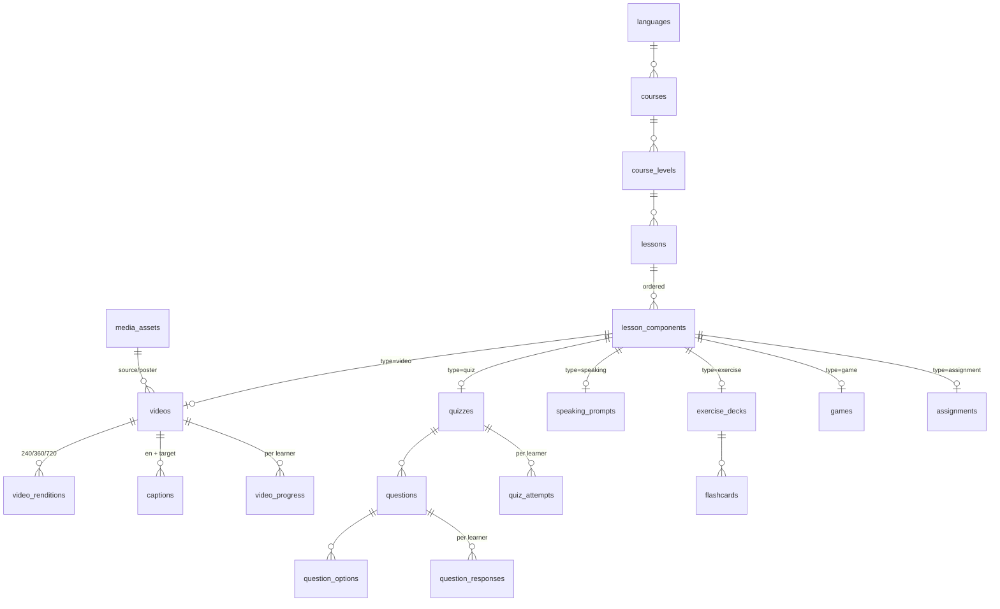

# MAHADUM.360 — Learning Content Model
## Lessons · Video · Quiz · Media Pipeline

Companion to *Backend Architecture*. Expands the central (shared) content domain with the detail engineering and content teams need to build authoring, delivery, and grading.

---

## 1. Content hierarchy

```
Language (Yoruba / Igbo / Hausa / Pidgin)
└── Course            "Igbo for Beginners"
    └── Level         "Level 1 — Greetings"   (end-of-level assessment)
        └── Lesson    "Morning Greetings"     (the atomic learning unit)
            └── Components — ordered, mandatory sequence:
                 1. 🎬 Video
                 2. ❓ Quiz
                 3. 🎙️ Speaking challenge
                 4. ✍️ Exercise (practice)
                 5. 🎮 Game
                 6. 📹 Assignment
```

**Business rules baked in**
- A lesson **cannot publish** without ≥1 video + ≥1 quiz + ≥1 speaking challenge (Rule 1).
- Components play in `position` order; learners can't skip ahead within a lesson.
- A course needs structured levels + end-of-level assessment + ≥1 cultural component (Rule 2).
- Progress finalises only when **all** components are complete (Rule 3); score = 30% video + 20% quiz + 25% speaking + 15% assignment + 10% engagement.

---

## 2. Component architecture — base + typed detail tables

Instead of one JSON blob per component, use a thin **base record** that every component shares, plus a **typed detail table** per component type. This keeps the ordered sequence uniform while letting video and quiz have real, queryable structure.

**lesson_components** (base — the sequence)
`id, lesson_id, type(video|quiz|speaking|exercise|game|assignment), position, title, is_required(default true), xp_value, settings(json)`

Each base row points to exactly one detail row by type:

| type | detail table |
|---|---|
| video | `videos` |
| quiz | `quizzes` → `questions` → `question_options` |
| speaking | `speaking_prompts` |
| exercise | `exercise_decks` → `flashcards` |
| game | `games` |
| assignment | `assignments` |

> Why not pure JSON: a quiz with shuffled questions, per-question audio, multiple answer types, scoring, and drop-off analytics is painful to query and validate inside a JSON column. Typed tables give you integrity, indexing, and reporting. Keep JSON only for genuinely freeform `settings`.

---

## 3. 🎬 Video model

A video has two faces: **lesson videos** (inside a lesson's component flow) and **cultural short-form videos** (60–180s, Netflix-style, can stand alone in a "Culture" feed). Same underlying tables; a flag distinguishes them.

### 3.1 Tables

**videos**
`id, lesson_component_id(nullable — null for standalone cultural), language_id, title, description, presenter_name, is_cultural(bool), kind(lesson|proverb|folktale|festival|song|history), duration_seconds, source_asset_id, poster_asset_id, default_quality(360p), status(uploading|processing|ready|failed)`

**video_renditions** — one row per quality/format
`id, video_id, quality(240p|360p|720p), protocol(hls|mp4), manifest_url, bitrate_kbps, size_bytes, ready(bool)`

**captions** — subtitles, multiple languages
`id, video_id, language_code(en|ig|yo|ha), format(vtt|srt), url, is_default`
> Every lesson video ships English subtitles + target-language subtitles (dual display).

**transcripts** *(optional, for search + a11y)*
`id, video_id, language_code, body(text), segments(json with timestamps)`

**video_progress** *(per learner — or fold into `component_progress.data`)*
`id, learner_profile_id, video_id, watched_seconds, last_position_seconds, percent, completed_at`

### 3.2 Upload → ready pipeline (async)

```
Content Owner uploads master file
   → store source in object storage (S3-compatible)
   → dispatch TranscodeVideo job  (status: processing)
   → generate renditions: 240p, 360p, 720p  (HLS adaptive)
   → generate poster/thumbnail
   → attach/auto-generate captions (en + target)
   → mark status = ready  → notify author
```

Use a managed pipeline rather than self-hosting FFmpeg if you can — **Cloudflare Stream, Mux, or Bunny.net** give adaptive HLS, per-quality renditions, captions, and global CDN out of the box. That matters here because of the next point.

### 3.3 Low-bandwidth delivery (critical for the market)
- **Adaptive HLS**, CDN-delivered, **signed/expiring URLs**.
- **Never default to 720p** — start at **360p** (Nigeria default), allow 240p on poor links, 720p on WiFi. Player auto-selects by measured throughput, user can override.
- **Offline download** for premium: up to 5 lessons, encrypted local cache, expiry on subscription lapse.
- Target lesson screen load **< 3s on 3G**.

### 3.4 What the client gets (play time)
`GET /lessons/{id}/play` returns each video component with a signed HLS manifest, poster, duration, and the caption tracks — never the raw master file.

### 3.5 Progress
Client posts `watched_seconds` / `last_position` periodically and on exit. The video component is "complete" at a configurable threshold (e.g. ≥90% watched) so a learner who watches the whole thing isn't blocked by the final second.

---

## 4. ❓ Quiz model

A quiz is a component that owns ordered **questions**, each of a specific **type**, each with **options** and a server-held correct answer.

### 4.1 Tables

**quizzes**
`id, lesson_component_id, title, pass_threshold(e.g. 0.6), shuffle_questions(bool), max_attempts(nullable — null = unlimited), hearts_enabled(bool)`

**questions**
`id, quiz_id, type, prompt, prompt_audio_asset_id(nullable), prompt_image_asset_id(nullable), explanation, target_text(nullable), tone_marks(json nullable), difficulty(1-3), points(default 1), position`

**question_options**
`id, question_id, label, media_asset_id(nullable), is_correct(bool), match_target(nullable — for pair matching), position`

**question_responses** *(per learner — the answer ledger)*
`id, learner_profile_id, question_id, quiz_attempt_id, given_answer(json), is_correct, time_ms, hearts_lost, answered_at`

**quiz_attempts**
`id, learner_profile_id, quiz_id, attempt_no, score, passed, started_at, completed_at`

### 4.2 Question types

| type | learner does | answer shape |
|---|---|---|
| `mcq_single` | pick one | option_id |
| `mcq_multi` | pick several | [option_id…] |
| `true_false` | true/false | bool |
| `match_pairs` | match left↔right (word↔image/audio) | [{left,right}] |
| `word_bank` | arrange word tiles into a sentence | [option_id ordered] |
| `fill_blank` | choose/type the missing word | option_id / text |
| `type_what_you_hear` | type the phrase from audio | text (fuzzy-graded) |
| `listen_and_respond` | hear a line, pick the correct reply | option_id |
| `complete_the_chat` | finish a chat bubble exchange | option_id |
| `pronounce` | say the phrase (bridges to speaking) | audio submission → speaking flow |

### 4.3 Example — a quiz question (stored)

```json
{
  "id": 5012,
  "quiz_id": 88,
  "type": "listen_and_respond",
  "prompt": "You hear a greeting. Choose the correct reply.",
  "prompt_audio_asset_id": 9001,        // "Ụtụtụ ọma"
  "tone_marks": { "Ụtụtụ ọma": "high-low-low" },
  "explanation": "‘Ụtụtụ ọma’ means ‘good morning’; the polite reply is ‘Ụtụtụ ọma’.",
  "options": [
    { "id": 1, "label": "Ụtụtụ ọma",  "is_correct": true,  "position": 1 },
    { "id": 2, "label": "Ka chi fo",  "is_correct": false, "position": 2 },
    { "id": 3, "label": "Daalụ",      "is_correct": false, "position": 3 }
  ]
}
```

### 4.4 Example — `match_pairs`

```json
{
  "type": "match_pairs",
  "prompt": "Match the Igbo word to its meaning.",
  "options": [
    { "id": 11, "label": "Mama",  "match_target": "Mother" },
    { "id": 12, "label": "Nna",   "match_target": "Father" },
    { "id": 13, "label": "Nwa",   "match_target": "Child"  }
  ]
}
```

### 4.5 Grading (server-side, always)

- The client **never** receives `is_correct` at play time — it's stripped from the `/play` payload.
- Learner submits → server grades → returns `{ correct, correct_answer, explanation }`.
- `type_what_you_hear` uses normalised/fuzzy comparison (strip case, tolerate accents pending tone rules) so a near-miss isn't punished harshly.
- Each response is written to `question_responses` (powers drop-off analytics and the speaking/quiz weights in the progress score).

### 4.6 Hearts interaction (respecting Rule 4)
- Wrong answer → optional gentle red pulse + lose one heart (if `hearts_enabled`).
- **Hearts never lock core learning.** At zero hearts the learner is offered practice or a rewarded ad to refill — they are **never** dead-ended out of a lesson. Premium = unlimited hearts.

---

## 5. Other component types (brief, for completeness)

**speaking_prompts** `id, lesson_component_id, prompt_text, target_text, target_audio_asset_id, tone_targets(json)`
→ learner records audio → `speaking_submissions` (AI scoring **deferred / Option B**; ships as parent-review + "needs tone practice" badge; AI plugs into the kept `ai_score` column later).

**exercise_decks / flashcards** `decks: id, lesson_component_id, mode(spaced_repetition)` · `flashcards: id, deck_id, front_text, back_text, image_asset_id, audio_asset_id, mnemonic`
→ spaced-repetition practice mapping word ↔ image ↔ audio ↔ real-life usage.

**games** `id, lesson_component_id, game_type(memory|match|tone_pop|word_builder), config(json)`
→ lightweight reinforcement; config drives a reusable game engine on the client.

**assignments** `id, lesson_component_id, prompt, expected_media(video|audio), max_duration_seconds`
→ learner records a clip → parent reviews → on approval the family earns coins.

---

## 6. Authoring (CMS) & versioning

**Authoring flow (Content Owner / Teacher)**
`Create course → add level → add lesson → add components → upload/transcode video → build quiz (questions + options) → add speaking/exercise/game/assignment → run publish checks → publish`.

**Publish checks (enforced server-side)**
- lesson has ≥1 video + ≥1 quiz + ≥1 speaking; every video `status = ready`; every quiz has ≥1 question with exactly one correct config; captions present.

**Versioning**
- Content is **versioned**: `draft` vs `published`. Learners always consume the **published** snapshot; edits create a new draft and don't disrupt in-progress learners until republished.
- Add `version` + `published_at` on `lessons` (or a `lesson_versions` table if you need full history/rollback).

---

## 7. Consumption — the `play` payload

```json
GET /api/v1/lessons/451/play
{
  "lesson": { "id": 451, "title": "Morning Greetings", "est_minutes": 4 },
  "components": [
    { "id": 1, "type": "video", "position": 1, "xp": 5,
      "video": { "duration": 92, "poster": "https://cdn/...jpg",
        "hls": "https://cdn/.../signed.m3u8",
        "captions": [ {"lang":"en","url":"..."}, {"lang":"ig","url":"..."} ] } },
    { "id": 2, "type": "quiz", "position": 2, "xp": 10,
      "quiz": { "pass_threshold": 0.6, "hearts_enabled": true,
        "questions": [ /* options WITHOUT is_correct */ ] } },
    { "id": 3, "type": "speaking", "position": 3, "xp": 8,
      "speaking": { "prompt": "Say: Ụtụtụ ọma", "target_audio": "https://cdn/...mp3" } }
    /* exercise · game · assignment … */
  ],
  "progress": { "completed_components": 0, "total": 6 }
}
```
Client walks components in order, posting progress as it goes:
`POST /lessons/451/progress` · `POST /components/2/answer` · `POST /speaking-submissions`.

---

## 8. Media storage & CDN

- **Object storage** (S3 / Cloudflare R2) for masters + derived assets; **CDN** for delivery; **signed, expiring URLs** everywhere.
- **Managed video** (Cloudflare Stream / Mux / Bunny) recommended for adaptive HLS + captions + global edge — avoids running your own transcode farm and handles the 240/360/720 ladder.
- Audio (lesson narration, question prompts, speaking targets) via the same `media_assets` table; prefer compact formats (AAC/Opus) for low-data.
- Captions as VTT; transcripts indexed for search + accessibility.

---

## 9. Content ER (Mermaid)



---

## 10. Analytics & xAPI hooks (content events)

Emit xAPI statements (mirrored to the LRS, never authoritative for money/gating) on:
`video.played / video.completed`, `quiz.answered (per question, correct/incorrect)`, `quiz.passed/failed`, `speaking.submitted`, `lesson.completed`. These power lesson **drop-off analytics** (where learners quit — e.g. after video, before quiz) and the teacher speech/quiz grids.

---

### Open content questions
- Quiz attempt cap: unlimited vs limited (schema supports both via `max_attempts`).
- `type_what_you_hear` tone-mark strictness — needs native-speaker rubric.
- Managed video vendor selection (Cloudflare Stream vs Mux vs Bunny) — pick on price/region/egress.
- Spaced-repetition algorithm for flashcards (SM-2 vs Leitner) — product call.
